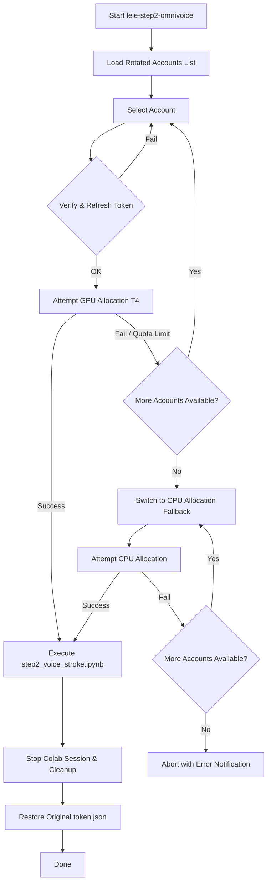

# 🚀 Google Colab Fallback Setup for lele-step2-voicestroke

> [!NOTE]
> We have added a 100% Docker-isolated fallback runner for **lele-step2-voicestroke** that leverages **Google Colab** runtimes via the `google-colab-cli` library, running entirely in a container named `lele-step2-omnivoice`. All container files are stored inside the `VPS_Steps` directory.

---

## 📂 New & Updated Files
All container files are located inside [VPS_Steps](file:///media/vpsg16gb/Workspace/lelehoctiengtrung/Pipeline_lelehoctiengtrung/lele-step2-voicestroke/VPS_Steps/):
1. **[VPS_Steps/run_step2_colab.py](file:///media/vpsg16gb/Workspace/lelehoctiengtrung/Pipeline_lelehoctiengtrung/lele-step2-voicestroke/VPS_Steps/run_step2_colab.py)**: Python script to verify, swap, and manage Google Colab CLI sessions using rotated accounts.
2. **[VPS_Steps/Dockerfile](file:///media/vpsg16gb/Workspace/lelehoctiengtrung/Pipeline_lelehoctiengtrung/lele-step2-voicestroke/VPS_Steps/Dockerfile)**: Docker image specification installing `google-colab-cli` and basic dependencies.
3. **[VPS_Steps/docker-compose.yml](file:///media/vpsg16gb/Workspace/lelehoctiengtrung/Pipeline_lelehoctiengtrung/lele-step2-voicestroke/VPS_Steps/docker-compose.yml)**: Service definition mapping parent source files and mounting Colab credentials.
4. **[.gitignore](file:///media/vpsg16gb/Workspace/lelehoctiengtrung/Pipeline_lelehoctiengtrung/lele-step2-voicestroke/.gitignore)**: Updated to ignore temporary log files and `*_output.ipynb` notebook copies generated during colab execution.

---

## 📊 Summary of Saved Accounts Check
We verified all 6 Google accounts saved under `/home/vpsg16gb/.config/colab-cli/rotated_tokens/`. All are active, valid, and refreshed successfully:

| Account Email | Status | Last Action |
|---|---|---|
| `analibrary2909@gmail.com` | ✅ Valid | Refreshed |
| `comics2909.1@gmail.com` | ✅ Valid | Refreshed |
| `lchau4501@gmail.com` | ✅ Valid | Refreshed |
| `thanhngaho968@gmail.com` | ✅ Valid | Refreshed |
| `triplex2909.001@gmail.com` | ✅ Valid | Refreshed |
| `triplex2909.002@gmail.com` | ✅ Valid | Refreshed |

---

## ⚙️ Orchestration and Fallback Strategy

The orchestrator script employs a multi-tier fallback logic to maximize resource availability:



---

## 🚀 How to Execute

To build and run the step 2 fallback inside the Docker container:

```bash
# Navigate to the VPS_Steps folder
cd /media/vpsg16gb/Workspace/lelehoctiengtrung/Pipeline_lelehoctiengtrung/lele-step2-voicestroke/VPS_Steps

# Build the container
docker compose build

# Start the fallback execution
docker compose run --rm step2-colab
```

---

## 🔔 Telegram Notifications
All push actions and update notifications have been routed to the Telegram channel thread according to system policy (Chat ID: `-1003954353565`, Topic: `3054`).
